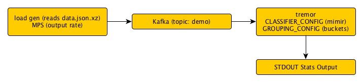

**tremor-runtime**
------------------

This tool allows to configure a pipeline that moves data from a source to a destination. The pipeline consists of multiple steps which are executed in order. Each step is configurable on a plugin basis.


# Externals

[Jenkins](https://containers.jenkins.service.bo1.csnzoo.com/blue/organizations/jenkins/build-docker-data-engineering-tremor-runtime/activity)

[Artifactory](https://artifactory.service.bo1.csnzoo.com/artifactory/webapp/#/artifacts/browse/tree/General/docker-wayfair/wayfair/data-engineering/tremor-runtime)

# Plugins
Some plugins require additional configuration to be passed others do not.

## On-ramp
The input step defines the source of the data.

### stdin
The `stdin` plugin reads from STDIN each line is treated as one event.

### kafka
The `kafka` plugin reads from a given Kafka topic. The configuration passed is: `{"group_id": "<group.id>", "topics": ["<topic>"], "brokers": ["<broker>", "<broker>", ...]}`.

In addition it is possible to specify the key `rdkafka_options` which allows to set additional (librdkafka specific options)[https://github.com/edenhill/librdkafka/blob/master/CONFIGURATION.md]. This is done as a map where the key is option option name and the value the setting **as a string**.

An example would be:
```
{
  "rdkafka_options": {"auto.offset.reset": "beginning"},
  ...
}
```

### mssql
The mssql plugin executes a query against a mssql database and feeds the rows as JSON into kafka. The query can be executed on a periodic basis. It is confugured using the following config: `{"host": "<sql server host>"[, "port": <sql server port default - 1433>], "username": "<username>", "password": "<password>", "query": "<query to run>"[, "interval_ms": <interval in milliseconds to re-execute the query>]}`

Note: As this is JSON encoded some type information will be lost!


## Parser
Parsers handle converting the event from the raw binary to a representation format.

### raw (default)
The `raw` parser performs no additional steps and just passes the event on untouched.

### json
The `json` parser parses the input as a JSON and fails if the data is invalid.

## Classifier
Classifiers handle event classification based on rules.

### constant (default)
The `constant` classifier classifies all events with the type passed as it's config.

### mimir
The `mimir` classifier uses the Mimir matching language to match rules against given classifications.

The configuration is provided as a JSON in the form: `[{"rule1": "classification1"}, {"rule2": "classification2"}, ...]`. If no rule matches the classification is set to `"default"`.

## Grouping
The grouping defines the algorithm used to group classified events.

### pass (default)
The `pass` grouping will pass all events.

### drop
The `drop` grouping will drop all events.

### bucket
The bucket grouper allows for rule based rate limiting, for each classification you can specify a limit in events per second that will be applied using a sliding window with 10ms granularity. buckets are defined by: `[{{"name": "<name>", "rate": <rate>[, "time_range": <time range in ms>, "windows": <windows per range>, "keys": ["<dimension1>", ...]]}}]`

## Limiting
The limiting plugin is responsible for limiting the entirety of the event stream after grouping has been performed.

### pass (default)
The `pass` limiter will pass all events.

### drop
The `drop` limiter will drop all events.

### percentile
The `percentile` limiter will keep a percentage of events. The percentage is provided as a fraction passed to it's config. `0` equals the `drop` limiter, `1` equals the `pass` limiter and `0.9` would mean 90% of the events pass.

It is possible to also provide 3 more values, `low limit`, `high limit` and `adjust`. If those are provided the percentile will adjust to keep the the feedback between low and high limits, where lower is better and higher is worse. Every time the feedback is either `lower limit` then `adjust` will be added to the `percentile` until it reaches `1` (`100%`). If the feedback exceeds `high limit` then `adjust` will be subtracted from `percentile` until it reaches a `adjust` as a lowest value.

### windowed
The `windowed` limiter limits the total event flow within a given time window based on a sliding window algorithm. It can be configured with `<time range>:<sub windows>:<rate>`. `1000:100:500` Would mean we have a window of `1000ms` (`1s`) split into `100` buckets and allow `500` events during this timeframe.

It is possible to also provide 3 more values, `low limit`, `high limit` and `adjust`. If those are provided the rate will adjust to keep the the feedback between low and high limits, where lower is better and higher is worse. Every time the feedback is either `lower limit` then `adjust` will be added to the `rate`. If the feedback exceeds `high limit` then `adjust` will be subtracted from `rate` until it reaches a `adjust` as a lowest value.

## Off-Ramp
The off-ramp plugin defines the destination the data is forwarded to.

There are two off-ramps, the default off-ramp specified as `--off-ramp` which will get all events which were not marked to be dropped. Then there is `--drop-off-ramp`, this is where all events that are marked to be dropped go.

### stdout
The `stdout` off-ramp writes events to stdout, one event per line.

### kafka
The `kafka` off-ramp writes events to a Kafka topic, this is configured in the format `<topic>|<broker list>`.

### null (default for the diverted offramp)

The `null` off-ramp drops all events. 

### debug
The `debug` off-ramp prints a list of classifications and pass and drop statistics for them every second.

### es

The `es` off-ramp stores events to elastic search. It takes a lost of `endpoints` and `index` to write to. In addition a `batch_size` is defined to specify how many events are transmitted per batch as well as a `batch_timeout` which defines at what point backoff happens. If any write request exceeds the `batch_timeout` a timeout will be set and events will be dropped until the backoff passed. `threads` defines the number of treads in the pool that handles the writes while `concurrency` defines how many parallel writes can be in flight at a time. `backoff_rules` can be defined to specify the progression for repeating timeouts. If `prexif_key` is defined the value of the key will be prepended (with an `_` as seperator!). If `append_date` is set to true the current date in the format `%Y.%m.%d` is added (with a `-` as seperator!).
```
{
  "endpoints": ["<url>"[, ...] ],
  "index": "<index>",
  "batch_size": <size of each batch>, 
  "batch_timeout": <maximum allowed timeout per batch>,
  ["threads": <number of threads used to serve asyncornous writes>,]
  ["concurrency": <maximum number of batches in flight at any time>,]
  ["backoff_rules": [<1st timeout in ms>, <second timeout in ms>, ...],]
  ["prefix_key": "<key to use as prefix>",]
  ["append_date": <bool>,]
  ["pipeline": <pipeline name>,]
}
```

Note, requests are *NOT* canceled after the timeout as there is no way to recall a bulk write from elastic search.

# Docker

The docker container build takes environment variables for each plugin. The `input` plugin is provided as `INPUT=...` and it's configuration as `INPUT_CONFIG=...`. Plugins and configs may be omitted and will then be replaced with a default, for configurations the default is an empty configuration.

In addition the `RUST_LOG` environment variable can be passed to define the log level of the application.

## Tests

Tests can be found in `docker/goss.yaml`

# Local demo mode

Docker needs to have at least 4GB of memory.

You need to be connected to the VPN.

To demo run `make demo-images`  to build the demo containers and then `make demo-run` to run the demo containers.

To [demo with Elasticsearch and kibana](#elastic-demo) 'make demo-elastic-run'. The 'demo-run' target does not run elsticsearch or kibana. In addition a full [kitchen sink demo](#kitchen-sink-demo) that also off-ramps data to influx and provides a  .


## Design

The demo mode logically follows the flow outlined below. It reads the data from data.json.xz, sends it at a fixed rate to the `demo` bucket on Kafka and from there reads it into the tremor container to apply classification and bucketing. Finally it off-ramps statistics of the data based on those steps.



## Configuraiton

### Config file

The demo con be configured in the `demo/demo.yaml` file. A abbreviated version (with the critical elements) can be seen below. In the following sections we'll quickly discuss each of the configuration options available to customize the demo.
```
version: '3.3'
services:
  # ...
  loadgen:
    # ...
    environment:
      - MPS=100
      # ...
  tremor:
    # ...
    environment:
      - CLASSIFIER_CONFIG=[{"short_message=info OR short_message=info":"info"},{"short_message=ERROR":"error"}]
      - GROUPING_CONFIG=1000;100;default:90|info:10|error:100
      # ...
```

### Load Generator

#### MPS

The rate at which data is generated can be configured in the `demo/demo.yaml` file in the `loadgen` section under the `MPS` (messages/events per second) variable. How high this can be set depends on the system running the demo.

### Tremor

The normal tremor container is used for testing, while all the variables described above can be configured most of them **should not be changed**. The variables that can safely be changed will be listed below with a short explanation.

#### `CLASSIFIER_CONFIG`

The Mimir classifier config, two demo rules are included but further rules to match the `demo/data.json.xz` test data can be added.

#### `GROUPING_CONFIG`

The configured classification / bucketing rules, they should match the classifications defined in `CLASSIFIER_CONFIG`. By default the grouping limiter is configured to use a sliding window of `100` sub windows over a `1000` ms (`1s`) interval.

### Test data

The test data is read from the `demo/data.json.xz` file. This file needs to contain 1 event (in this case a valid JSON object) per line and be compressed with `xz`. Changing this document requires re-running `make demo-images`!

### Elastic demo

The base tremor demo can be extended to include Elasticsearch + [kibana](#kibana) via:

```
make demo-elastic-run
```

This exposes Elasticsearch on localhost port 9200 and [kibana](#kibana) as documented in it's section.

### Kitchen Sink demo

The kitchen sink adds InfluxDb, Telegraf and Grafana to the base tremor demo with Elasticsearch and Kibana

```
make demo-all-run
```

To inject Grafana dashboards and configure InfluxDb for monitoring bootstrap Grafana and influx
once the system stabilizes. Make sure to install the [Demo Tools](#demo-tools)  first!

```
make demo-all-bootstrap
```

#### Grafana
You can access [Grafana](http://localhost:3000/login) with the credentials `admin`/`tremor`. Navigate to the `Tremor Demo` dashboard.


#### Kibana
You can access [Kibana](http://localhost:5601/app/kibana). To use it first set up a new index under *Management* -> *Index Patterns*. The pattern should be `demo` and the time filter should be set to `I don't want to use the Time Filter`. After saving navigate to *Discover*.


### Demo tools

The influx client and Telegraf can be installed locally for dev insights into the demo experience as follows:

```
brew install jq
brew install influxdb
brew install telegraf
```

Only Telegraf and jq is required to run the demos, the influx cli is optional (and ships with influxdb on OS X in homebrew)

### Benchmark Framework

The tremor-runtime supports a micro-benchmarking framework via specialized on-ramp ( blaster ) and off-ramp ( blackhole )
tremor input and output adapters. Benchmarks ( via blackhole ) output high dynamic range histogram latency reports to
standard output that are compatible with HDR Histogram's plot files [service](https://hdrhistogram.github.io/HdrHistogram/plotFiles.html)

To execute a benchmark, build tremor in **release** mode and run the examples from the tremor repo base directory:

```
./bench2/bench0.sh
```