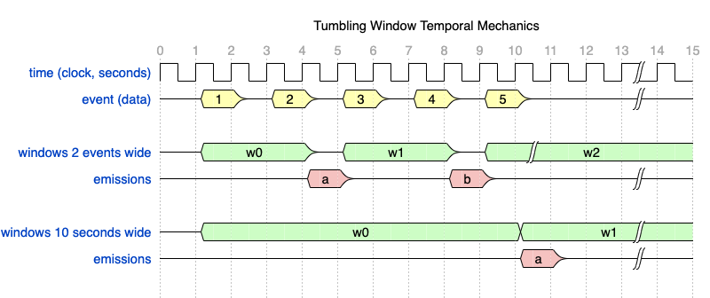
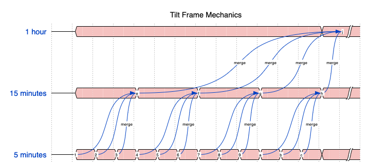

# Trickle Walkthough
---

In this section we walk through increasingly complex tremor query language ( trickle )
programming examples, introducing key concepts as we progress.

## Overview

Trickle is a near real-time stream-based structured query language that
builds on the tremor scripting language.

Trickle queries are compiled in pipeline DAGs and replace the yaml pipeline
format used in previous versions to describe event processing graphs in
the tremor runtime.

The simplest possible query in trickle is

```trickle
select event from in into out; # A simple passthrough query pipeline
```

This would be configured/programmed as follows in the more verbose
pipeline yaml format:

```yaml
pipeline:
  - id: main
    interface:
      inputs:
        - in
      outputs:
        - out
    links:
      in: [ out ]
```


The `event` keyword selected the event from the standard input stream `in`
and passes it through unchanged to the standard output stream `out`.

In tremor's trickle query langauge queries are compiled and optimised and
data is streamed though the query. Data can be passed through, transformed,
filtered, aggregated, branched or combined to form continuous stream processing
algorithms.

Like other event processing languages, trickle _inverts_ the relationship between
query and data when compared to normal RDBMS SQL langauges. Instead of running a
dynamic query against static in memory or disk persisted data, we compilse and
optimise queries and stream near real-time data through each query.

Data can be ingested from the outside world via the 'in' standard stream.
Data can be produced to the outside world via the 'out' standard stream.
Errors can be processed through a standard 'err' standard stream.

These three primitives are analgous to the `stdin`, `stdout` and `stderr` streams
in UNIX-like systems. These can be chained or interconnected via connecting multiple
statements together to form a directed acyclic graph.

We can branch inputs using `where` and `having` clauses as filters to logically
partition streams into independent processing streams.

In the below example we pratition events by their `seq_num` field. If the number
is even, we branch the corresponding events into a stream named `evens`. If the
number is odd, we branch to a stream named `odds`.

The logical inverse of branching is to unify or union streams together, this operation
is also supported via the select operation and is demonstrated below. We combine
the `evens` and `odds` streams into the standard output stream

```trickle
# create private intermediate internal streams
create stream evens;
create stream odds;

# branch input into even/odd sequenced events using where clause
select { "even": event } from in where (event.seq_num %2 == 1) into evens;
select { "odd": event } from in where (event.seq_num %2 == 0) into odds;

# combine / union evens and odds into standard out stream
select event from evens into out;
select event from odds into out;
```

We can test this with a simple json event using the `tremor-query` command line tool

```json
{
    "seq_num": 4,
    "value": 10,
    "group": "horse"
}
```

Assuming the trickle query is stored in a file called `evenodd.tricle` with the sample event
in a file called `data.json`

```bash
$ tremor-query evenodd.trickle -e data.json
```

The command line tool will repeatedly inject the event `-e` argument document and we would
expect to see output from the tool as follows:

```bash
out>>
    1 | {
    2 |   "odd": {
    3 |     "seq_num": 4,
    4 |     "value": 10,
    5 |     "group": "horse"
    6 |   }
    7 | }
```

## Scripts and Operators


The query language is _backwards compatible_ with the legacy pipeline format in that the same
operations are available in the old and new syntax. The new structured query syntax is more
flexible and powerful, however.

For example, here's the logic for an entire backpressure algorithm that could be introduced as
a proxy between two systems:

```trickle
define generic::backpressure operator bp
with
    timeout = 10000,
    steps = [ 1, 50, 100, 250, 750 ],
end;

create operator bp from bp;
select event from in into bp;
select event from bp into out;
```

A slightly more complex example that uses both operators and the tremor scripting langauge
with the query langauge all together:

```trickle
define grouper::bucket operator kfc;

define script categorize
script
  let $rate = 1;
  let $class = event.`group`;
  { "event": event, "rate": $rate, "class": $class };
end;

create operator kfc from kfc;

# where script definition and instance name are the same, we can
# omit the from clause in operator and script 'create' statements
create script categorize;

# Stream ingested data into categorize script
select event from in into categorize;

# Stream scripted events into kfc bucket operator
select event from categorize into kfc;

# Stream bucketed events into out stream
select event from kfc into out;
```

Operators, in the query langauge as in the pipeline format are defined as `<module>::<name>` in the
context of an operator definition clause. Operators, like script definitions can take arguments.

Definitions in tremor are non-executing. They should be considered as templates or specifications.

In the query langauge, any `define` clause creates specifications, possibly with arguments for
specialization. They are typically incarnated via the `create` clause. Anything that is `create`ed
will form a stream or node in the query graph - these *do* consume memory and participate in a
pipeline query algorithm.

So in the above example, the `categorize` script and the `categorize` node have both a definition
or specification __and__ an instance node that participates in the graph at runtime. It is often
convenient to use the same name where there is only one instance of an operator of a given type.

## Building Query Graph Algorithms

Data streams can be branched and combined in the trickle query language via
the select statement. The resulting graphs must be acyclic with no direct or
indirect looping cycles.

### Branching

Branching data streams to multiple streams is performed via select operations

Branch data into 3 different output stream ports

```trickle
select event from in into out/a;
select event from in into out/b;
select event from in inout out/c;
```

Branch data into 3 different intermediate streams

```trickle
create stream a;
create stream b;
create stream c;

select event from in into a;
select event from in into b;
select event from in into c;
```

## Combining

Multiple data streams can also be combined via select operations.

Combine 3 data streams into a single output stream

```trickle
...

select event from a into out;
select event from b into out;
select event from c inout out;
```

Combine 3 data stream ports from 1 or many streams into a single output stream

```trickle
...

select event from a/1 into out;
select event from a/2 into out;
select event from b inout out;
```


## Aggregations

A key feature of the tremor query langauge are aggregations. These are supported with:

* Aggregate functions - An aggregate function is a function that runs in the context of a temporal window of events, emitting results intermittently
* Windows - A window is a range of event, clock or data time. There can be many different types of window
* Tilt Frames - A tilt frame is a chain of compatible windows with __decreasing__ resolution used to reduce memory pressure and preserve relative accuracy of windowed aggregate functions


An example clock-driven tumbling window:

```
define tumbling window `15secs`
 with
   interval = datetime::with_seconds(15),
end;

select {
    "count": stats::count(), # Aggregate 'count' function
    "min": stats::min(event.value),
    "max": stats::max(event.value),
    "mean": stats::mean(event.value),
    "stdev": stats::stdev(event.value),
    "var": stats::var(event.value),
}
from in[`15secs`] # We apply the window nominally to streams
into out;
```

Using windows is simple. We need to define the window specifications, such as a 15 second clock-based
tumbling window called `15secs` as above. We can then create instances of these windows at runtime by
applying those windows to streams. This is done in the `from` clause in `select` expressions.

Wherever windows are applied, aggregate functions can be used. In the abvove example, we are calculating
the minimum, maximum, average, standard deviation and variance of a `value` numeric field in data streaming
into the query via the standard input stream.

The query language is not constrained to to clock-driven window definitions. Windows can also be
data-drive or fully programmatic.

A more complete example:

```trickle
select {
    "measurement": event.measurement,
    "tags": patch event.tags of insert "window" => window end,
    "stats": stats::hdr(event.fields[group[2]], [ "0.5", "0.9", "0.99", "0.999" ]),
    "class": group[2],
    "timestamp": win::first(event.timestamp),
}
from in[`10secs`, `1min`, `10min`, `1h`]
where event.measurement == "udp_lb_test"
   or event.measurement == "kafka-proxy.endpoints"
   or event.measurement == "burrow_group"
   or event.measurement == "burrow_partition"
   or event.measurement == "burrow_topic"
group by set(event.measurement, event.tags, each(record::keys(event.fields)))
into normalize;
```

In the above example we use a single aggregate function called `stats::hdr` which uses a high dynamic range
or HDR Histogram to compute quartile estimates and basic statistics against a number of dynamic grouping fields
set by the `group` clause. A group clause effectively partitions our operation by the group expressions provided
by the trickle query programmer. In the example, we're using the field names  of the nested 'fields' record on inbound
events to compose a component of a group that is also qualified by tags and a measurement name. The field component
is used as a numeric input to the histogram aggregate function.

In the `from` clause, we are using a tilt frame, or a succession of window resolutions over which this aggregate
function is producing results. So a `10secs` window is emitting on a 10-second repeating basis into a `1min` frame.
So 6 times per second the state of the 10 second window is merged into the `1min` frame. This merge process is
performed for each frame in the tilt frame.

The advantage of tilt-frames is that as the target expression is __the same__ for each frame, we can _merge_ across
each frame without amplifying error - in short, we get the __effect__ of summarisation without loss of accuracy.

## Aggregation Mechanics

The mechanics of aggregation in the query langauge are non-trivial.

A high level non-normative summary follows.

### Windowing

Assuming a periodic event delivered every 2 seconds into tremor.



A size based window of size 2 would emit a synthetic output event every 2 events.
So the lifespan of a size based window is 2 events, repeated and non-overlapping for tumbling style windows.
In the illustration above events `1` and `2` in the first window `w0` produce a single synthetic or derivate event `a`
Events `3` and `4` in the second window `w1` produce a single synthetic or derivate event `b`
As there is no 6th event in the example illustration, we will *never* get another synthetic output event


Contrast this with the 10 second or clock-based tumbling window. In tfirst window `w0`s lifetime we capture
all events in the illustration.

### Tilt Frames

Assuming a continuous flow of events into tremor...




All the synthetic outputs of successive 5 minute windows that fit into a 15 minute period are __merged__
into the 15 minute window. All the outputs of successive 15 minute periods that fit into a 1 hour period
are __merged__ into the 1 hour window. By chaining and merging, tremor can optimise ( reduce ) the amount
of memory required across the chain when compared to multiple independent windows `select` expressions.
In the case of aggregate functions like ```stats::hdr`` or ```stats::dds``` the savings are significant.

If we imagine 1M events per second, that is 300M events every 5 minutes. 900M every 15,  3.6B every hour.

By using tilt frames we can maximally minimize internal memory consumption, whilst reducing the volume of
incremental computation ( per event, per frame ), and further whilst preserving relative accuracy for
merge-capable aggregate functions.

The converged statistics under merge exhibit the same relative accuracy at a fraction of the computational
and memory overhead without the using the tilt-frame mechanism. 


## Group Mechanics

The group clause in the query language partitions streams before windows and tilt frames
are applied. Groups can be set-based,  each-based or composites thereof.

### Set based grouping

Grouping by set partitions streams by a concatenation of expressions.

```trickle
select event from in
group by set(event.country, event.region)
into out;
```

In the example expression we are partitioning into a composite group that is
composed of the country and  region of each inbound event.

So we expect data of the following form

```json
{ "country": "US", "region": "east", "az": "1", ... }
{ "country": "US", "region": "east", "az": "2", ... }
```

### Each based grouping

Given that our data can be nested, however, our data could be structured differently:

```json
{
  "country": "US",
  regions: {
    "east": [ "1", "2"],
  }
  ...
}
```

```trickle
select event from in
group by each(record::keys(event.regions))
into out;
```

Each field in the nested `locations` field becomes a component of our
set and qualified by country ...

### Limitations

There are cases however that are not currently easily partitionable with a
single sql expression due to limitations with the grouping clause. For example
what is we wanted to make availability zones a component of our group partitions?

How would we structure such a query?

```json
{
  "country": "US",
  regions: {
    "east": [ "1", "2"], # AZs by region
  }
  ...
}
```

```trickle
create stream by_country_region;

select { "country": event.country, "region": group[0], "azs": event.regions[group[0]] }
from in
group by each(record::keys(event.regions))
into by_country_region;
```

We can preprocess our inbound stream and collapse our locations
sub-record a single level by hoisting the `region` field to the
top level of a synthetic intermediate outbound stream `by_country_region`.

We can postprocess the intermediate stream `by_country_region` into a
single outbound stream that further extracts and hoists the 'az' dimension

```trickle
select { "country": event.country, "region": event.region, "az": group[0], }
from by_country_region
group by each(event.azs)
into out;
```

So, we need 2 select statements to compose a solution where there are multiple
nesting levels via successive extraction of group components. The same principle
works with more complex grouping requirements.

Once the grouping mechanics are resolved, windowing, aggregation and tilt-frames
can be applied to further refine queries.
